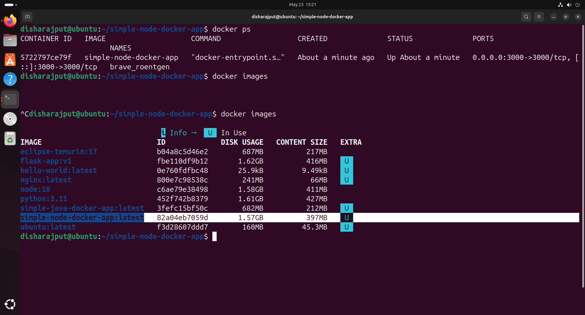
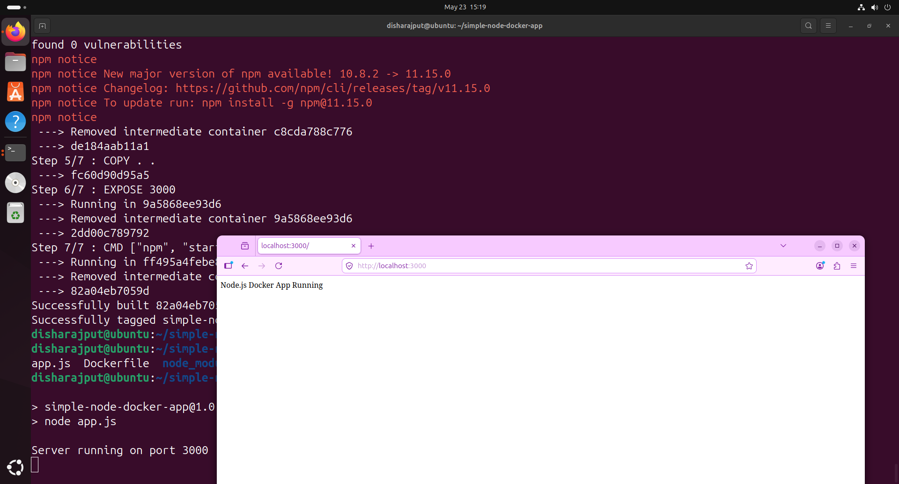

# 🚀 Simple Node.js Docker App


A beginner-friendly Node.js + Docker project built to understand containerization fundamentals using Express.js.

This project demonstrates how to:
- Build a Node.js application
- Create a Docker image
- Run containers
- Use Dockerfile best practices
- Understand Docker layer caching
- Use `.dockerignore`
- Expose and map ports

---

# 📁 Project Structure

```bash
simple-node-docker-app/
│
├── app.js
├── Dockerfile
├── .dockerignore
├── package.json
├── package-lock.json
└── README.md
```

---

# ⚙️ Tech Stack

- Node.js
- Express.js
- Docker

---

# 📜 Application Code

## app.js

```js
const express = require("express");

const app = express();

const PORT = 3000;

app.get("/", (req, res) => {
  res.send("Node.js Docker App Running 🚀");
});

app.listen(PORT, () => {
  console.log(`Server running on port ${PORT}`);
});
```

---

# 🐳 Dockerfile

```dockerfile
FROM node:18

WORKDIR /app

COPY package*.json ./

RUN npm install

COPY . .

EXPOSE 3000

CMD ["npm", "start"]
```

---

# 🚫 .dockerignore

```txt
node_modules
npm-debug.log
```

---

# 🔨 Build Docker Image

```bash
docker build -t simple-node-docker-app .
```

---

# ▶️ Run Docker Container

```bash
docker run -p 3000:3000 simple-node-docker-app
```

---

# 🌐 Access Application

Open in browser:

```txt
http://localhost:3000
```

Expected output:

```txt
Node.js Docker App Running 🚀
```

---
## 📸 Screenshots

### Running Containers


### Node App Running


---

# 🧠 Concepts Learned

- Docker Images vs Containers
- Dockerfile Instructions
- Layer Caching
- Port Mapping
- Containerized Dependencies
- Docker Best Practices
- `.dockerignore`
- Node.js Containerization

---

# 📌 Important Docker Concepts

## Why copy package.json first?

```dockerfile
COPY package*.json ./
RUN npm install
```

This improves build performance using Docker layer caching.

Dependencies reinstall only when `package.json` changes.

---

# 📷 Future Improvements

- Add Docker Compose
- Add MongoDB container
- Add NGINX reverse proxy
- Deploy on AWS EC2
- Use multi-stage Docker builds
- Add CI/CD pipeline

---

# 👩‍💻 Author

**Disha Rajpoot**

Learning Cloud • Docker • DevOps • Backend Infrastructure
